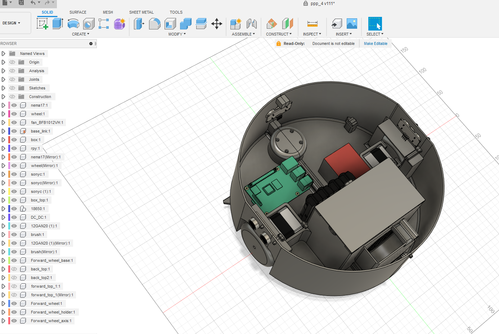

# Vacuum cleaner operation by ROS


## Model
For desing use Fusion 360. For converting from Fusion 360 to urfd tool: https://github.com/syuntoku14/fusion2urdf



link to model f2d: [model/ppp_4_v79_c.f3d](model/ppp_4_v79_c.f3d)

## Details

1) Raspberry py 3<br>
2) Lidar rplidar a1<br>
3) Motor Nema17<br>
4) Two small motors with reductor for brushes like this (https://www.amazon.com/uxcell-36RPM-Reduction-Terminals-Engine/dp/B0716T8KPD)<br>
5) Driver DRV8825<br>
6) IMU - remove b/c it get a lot of diveation<br>
7) 18650x4<br>
8) UltraSonic sensors x 2

## Soft
For robot use Ubuntu 18, but it has some problems with wifi. And ROS melodic.
For PC use Ubuntu 20 and ROS noetic.

## Run
run launch file on raspberry<br>
```
ppp_run/launch/ppp_run.launch 
```
and run on PC it sepatate console:
```
roslaunch nav nav.launch 
roslaunch path_creator path_creator.launch 
roslaunch path_visualizer path_visualizer.launch 
roslaunch path_creator_goal_mover path_creator.launch
```


## Links

| Node | README |
| ------ | ------ |
| Brush UltraSonyc Sensors and Voltage | [brushUltraSonycSensorsVoltage](brushUltraSonycSensorsVoltage) |
| convert_range_sensors_values | [convert_range_sensors_values](convert_range_sensors_values) |
| motor_driver | [motor_driver](motor_driver) |
| odom_publisher | [odom_publisher](odom_publisher) |
| path_creator | [path_creator](path_creator) |

