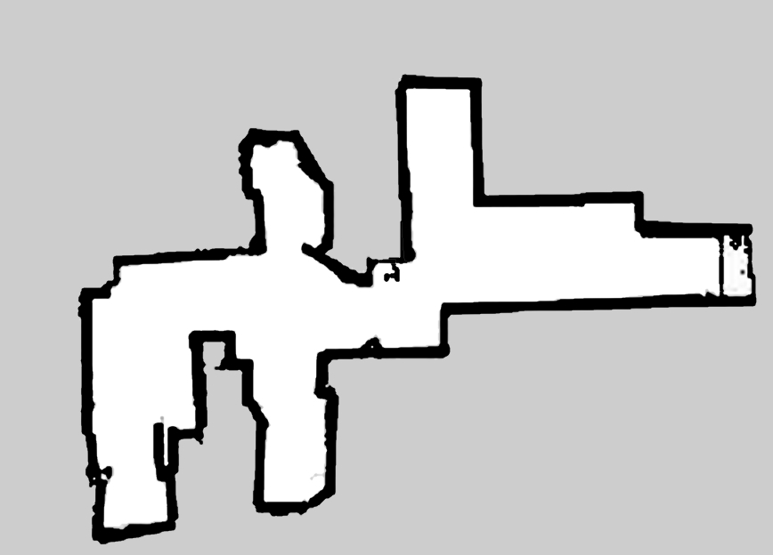
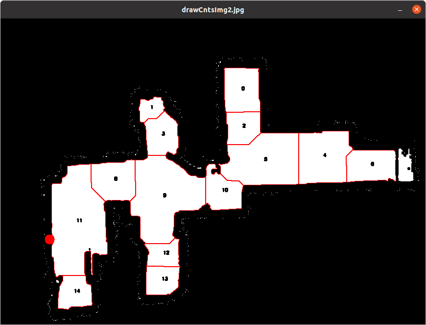
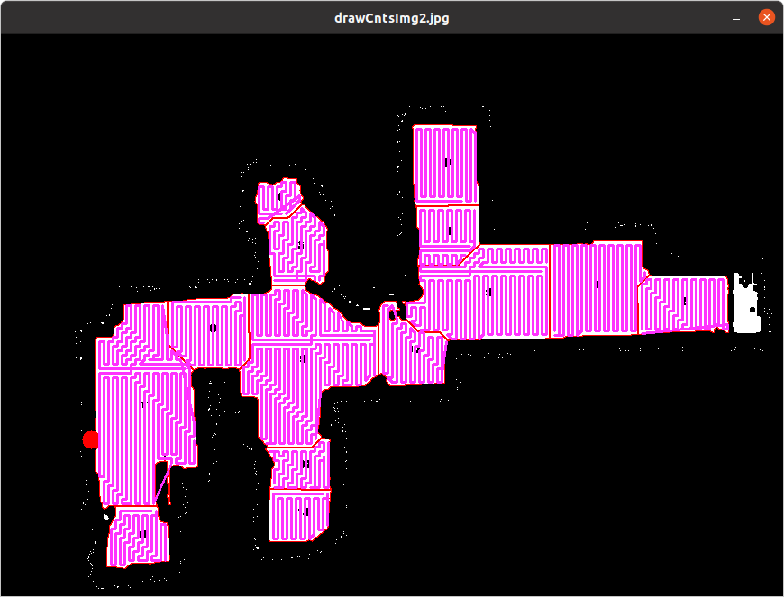

# path_creator

# How to use
## path_creator_node 

Main service is [path_creator/src/path_creator_node.py](path_creator/src/path_creator_node.py)

it get map, split it to counturs, and generate path on eatch contur. Also you can merge counturs<br>
launch it:
```bash
roslaunch path_creator path_creator.launch 
```
<br>
in launch file you can merge it like this:<br>

```xml
<node name="path_creator" pkg="path_creator" output="screen" type="path_creator_node.py">
        <param name="merge_0" value="['0','1']" />
        <param name="merge_1" value="['2','3','4','5','6','7','8']" />
</node>
```

## path_visualizer

For visualize counturs and path

launch:
```
roslaunch path_visualizer path_visualizer.launch 
```

## path_creator_goal_mover
For start creating full covarage path of conurs, and run it by sending goals to move_base.
<br>
# Libs
Conturs.py - lib for work with counturs

ex.:
```python
cnt_inst = Conturs(image)
cnts = cnt_inst.get_conturs(40)
```
image like:<br>


After get conturs:<br>


PathFinder.py - create path in the counturs

```python
pth = PathFinder(current_contur.contur, image.shape, 5, 1, start_point=start_point, debug_mode=True,neibor_distance=8)
covered_points = pth.get_route()
```

After get pathes:<br>


get_route is first version of path creation.


marker_lib.py - for markers in the map, like way points/line and goal indicator

# path_creator
path_creator_node.py - service<br>
subscribe /map topic<br>
call it:<br>
path_creator/get_by_id<br>
contur_creator/get_conturs<br>
contur_creator/get_by_id<br>
contur_creator/get_by_xy<br>
contur_creator/get_by_next_by_id<br>